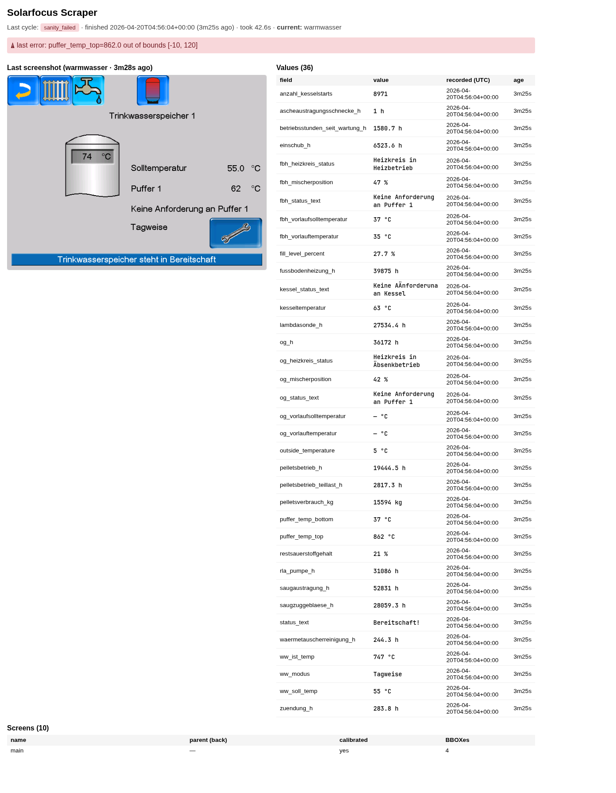
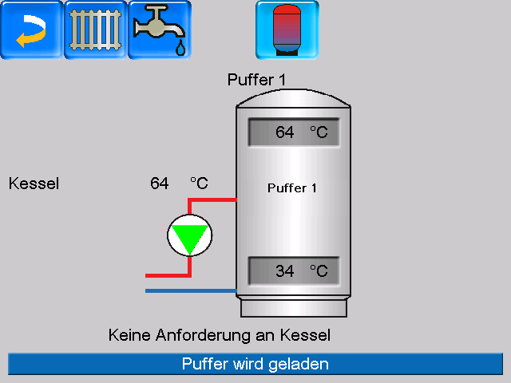
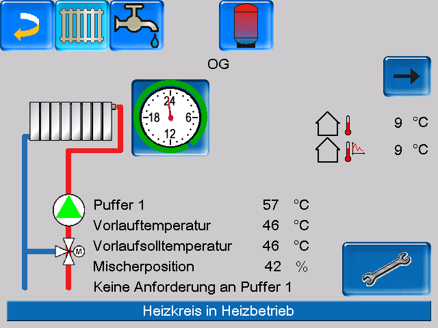
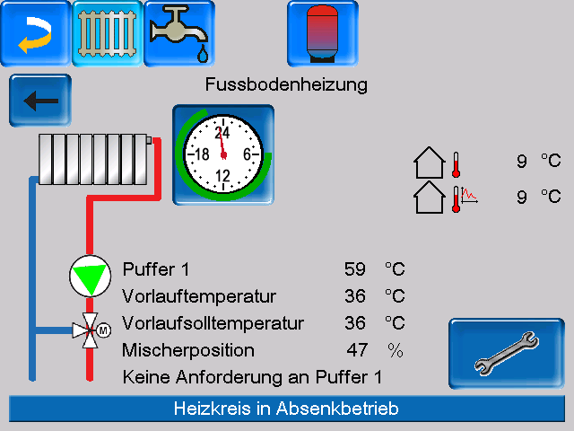
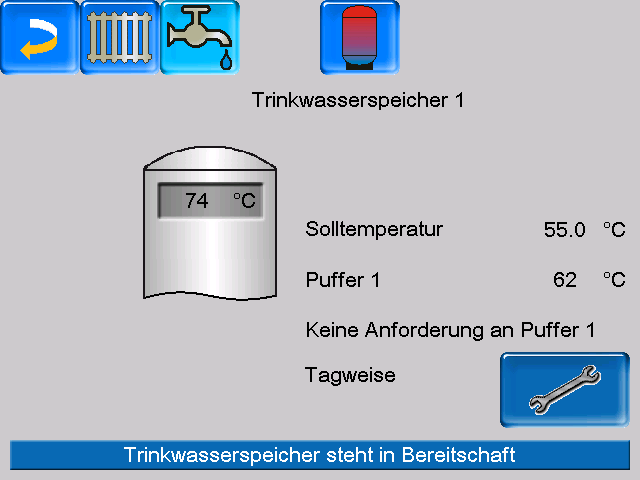
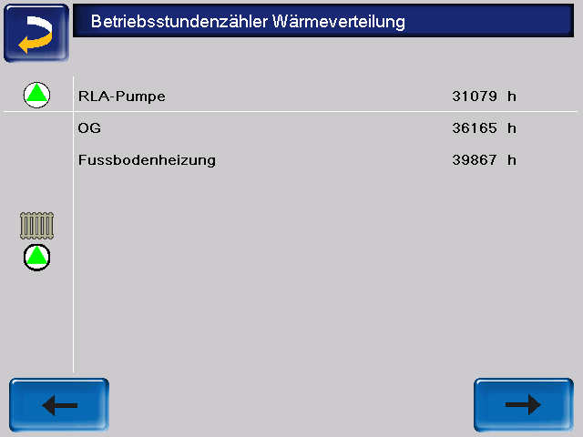

# solarfocus-scraper

[](https://github.com/nachtschatt3n/solarfocus-scraper/actions/workflows/build.yml)
[](./LICENSE)

Headless scraper for **Solarfocus pellet^top** biomass heaters. Drives the
built-in VNC touchscreen, OCRs values with Tesseract (German lang pack),
and publishes **36 sensors** to MQTT with **Home Assistant auto-discovery**.
The heater has no Modbus TCP / public API, so this is the least-bad way to
get live data into HA without swapping the controller.

A built-in HTTP server exposes a live status page (current screen image +
every value with timestamps + state-machine graph), Prometheus `/metrics`,
and a `/healthz` suitable for k8s liveness/readiness probes.



## What you get in Home Assistant

- **Main (5):** `kesseltemperatur`, `restsauerstoffgehalt`, `outside_temperature`, `status_text`, `fill_level_percent` (computed by counting dark pixels in the pellet-storage bar graphic)
- **Kessel (3):** `puffer_temp_top`, `puffer_temp_bottom`, `kessel_status_text`
- **Heizkreis OG (5):** `og_vorlauftemperatur`, `og_vorlaufsolltemperatur`, `og_mischerposition`, `og_status_text`, `og_heizkreis_status`
- **Heizkreis Fussbodenheizung (5):** `fbh_*` — same shape as OG
- **Warmwasser / Trinkwasserspeicher (3):** `ww_ist_temp`, `ww_soll_temp`, `ww_modus`
- **Betriebsstundenzähler p1 (7):** Saugzuggebläse, Lambdasonde, Wärmetauscherreinigung, Zündung, Einschub, Saugaustragung, Ascheaustragungsschnecke
- **Betriebsstundenzähler p2 (5):** Pelletsbetrieb Teillast, Pelletsbetrieb, Kesselstarts, Betriebsstunden seit Wartung, Pelletsverbrauch (kg)
- **Betriebsstundenzähler p3 / Wärmeverteilung (3):** RLA-Pumpe, OG Heizkreis, Fussbodenheizung
- **Controls (1):** `switch.solarfocus_pellet_heater_scraper_pause` — toggle from HA to pause VNC access when you want to use the touchscreen yourself
- **Alerts (4):** `binary_sensor.solarfocus_pellet_heater_alert_active`, plus `sensor.*_alert_title`, `sensor.*_alert_body`, `sensor.*_alert_last_seen` — the heater pops modal alerts ("KESSELREINIGUNG EMPFOHLEN!", "Pellet Mangel", etc.) that must be dismissed with OK. The scraper detects them by hashing the info icon, OCRs the title+body, publishes to MQTT, and clicks OK. Works for any future info-type alert too.

Each sensor arrives with the right HA `device_class` (`temperature`, `duration`, `weight`) and `state_class` (`measurement` for live values, `total_increasing` for counters), so the Energy dashboard and long-term statistics work out of the box.

## How it works

### Navigation as a state machine

The heater UI is modelled as a directed graph of screens. Each `Screen` has:

- a **hash region** — a small, static area of the UI (header title, version string) whose SHA-256 fingerprints the screen,
- a **parent** — the screen reached by clicking the back arrow (with an optional per-screen `back_xy` override for screens where that arrow is hidden),
- and a set of **forward edges** — "tap `(x, y)` on this screen → land on that one".

```
main ──► auswahlmenue ──► kundenmenue ──► betriebsstunden_p1 ──► p2 ──► p3
              │
              ├──► kessel
              ├──► heizkreise_og ──► heizkreise_fbh
              └──► warmwasser
```

`navigate_to(target)` does BFS over forward edges + back-arrow parent pointers. At every step it:

1. captures the screen and identifies it by hash,
2. computes the shortest path to the target,
3. clicks the first edge on that path (forward tap or back arrow),
4. repeats until at target, bailing after 12 steps.

On an **unknown** screen (hash doesn't match any), the state machine taps the back arrow to escape. This means a cycle recovers cleanly from whatever state the heater's touchscreen happened to be left in.

### OCR

Tesseract runs on 2× LANCZOS-upscaled crops. Per-field config picks between `--psm 7` with a `0123456789,.-` whitelist (for numeric values) and `--psm 7` in German mode (for status strings). Status-text fields set `invert=True` — grayscale conversion + inversion turns the white-on-blue status bars into the black-on-white text Tesseract vastly prefers.

### Coordinator

A single `Coordinator` singleton owns all runtime state. `run_cycle()` gates on `try_begin_cycle()` so a second concurrent caller returns `busy` immediately — two scheduled cycles cannot overlap, and nothing from the web UI can race the scheduler. State mutations take a short-held lock at phase boundaries (*connecting → navigating → ocr → publishing → done*); the HTTP handler snapshots under the same lock so the UI reflects in-flight progress rather than stale values.

## The screens it reads

| Kessel (buffer + boiler overview) | Heizkreis OG (upper floor heat circuit) |
|---|---|
|  |  |

| Fussbodenheizung (floor-heating circuit) | Warmwasser (DHW tank) |
|---|---|
|  |  |

| Betriebsstundenzähler p3 — Wärmeverteilung |
|---|
|  |

## Running it

### Locally

```bash
# System deps (Arch example — apt/dnf equivalents obvious)
sudo pacman -S tesseract tesseract-data-deu

# Python env (mise + uv)
mise install
mise run deps       # or: uv pip install -r requirements.txt

cp .env.example .env
# edit .env: VNC_HOST, VNC_PASSWORD, MQTT_HOST

python main.py run  # production loop + HTTP UI on :8080
```

Open `http://localhost:8080/status` — you get the live page shown at the top of this README.

### In Docker

```bash
docker build -t solarfocus-scraper .
docker run --rm -p 8080:8080 --env-file .env solarfocus-scraper
```

### In Kubernetes

Images are pushed to `ghcr.io/nachtschatt3n/solarfocus-scraper:latest` on every push to `main`. Reference Kubernetes manifests (Flux HelmRelease using the `bjw-s` `app-template` chart, with SOPS-encrypted VNC creds, Prometheus ServiceMonitor, and 6 alert rules) live in a separate homelab repo — happy to share as an example.

## CLI

| Command | Purpose |
|---|---|
| `python main.py probe` | Connect, capture the main screen |
| `python main.py click X Y` | Click `(X, Y)`, capture result |
| `python main.py explore` | Interactive tap-and-capture loop |
| `python main.py navigate <screen>` | Drive the state machine to a named screen |
| `python main.py screens` | List configured screens + edges + calibration status |
| `python main.py calibrate <screen>` | Compute + print the SHA-256 hash for the current screen |
| `python main.py ocr IMG x,y,w,h [--psm ...] [--invert]` | OCR a region of a saved image |
| `python main.py hash IMG x,y,w,h` | SHA-256 of a region |
| `python main.py cycle --dry-run` | Full cycle, no MQTT |
| `python main.py cycle --no-mqtt` | Full cycle, skip MQTT entirely |
| `python main.py cycle` | Full cycle, publish to MQTT |
| `python main.py run [--no-mqtt] [--interval N]` | Production loop + HTTP server on `:8080` |

## HTTP endpoints

| Path | Purpose |
|---|---|
| `/` or `/status` | Auto-refreshing HTML page — current screen, last capture image, every value with timestamp + age, state-machine graph |
| `/screenshot.png` | Raw PNG of the latest captured screen |
| `/metrics` | Prometheus format — scraped by the bundled `ServiceMonitor` when deployed on k8s |
| `/healthz` | `200` while the last cycle finished within `2 × SCRAPE_INTERVAL + 60s` |

## MQTT topic tree

| Topic | Payload | Retained |
|---|---|---|
| `solarfocus/<field>` | sensor value (string) | no |
| `solarfocus/scraper/status` | `ok` \| `busy` \| `navigation_failed` \| `sanity_failed` \| `paused` | yes |
| `solarfocus/scraper/last_run` | ISO8601 timestamp | yes |
| `solarfocus/scraper/pause` | `on` \| `off` — read at the start of each cycle | yes |
| `solarfocus/scraper/pause/set` | `on` \| `off` — HA writes here, scraper mirrors to `pause` | no |
| `solarfocus/scraper/last_error_image` | base64 PNG, published on `navigation_failed` | yes |
| `solarfocus/alert/active` | `on` \| `off` — modal alert currently showing on heater | yes |
| `solarfocus/alert/title` | most recent alert's title (e.g. `Kesselreinigung`) | yes |
| `solarfocus/alert/body` | most recent alert's body text | yes |
| `solarfocus/alert/last_seen` | ISO8601 timestamp of last alert detection | yes |
| `homeassistant/sensor/solarfocus_pellettop/<field>/config` | HA discovery JSON | yes |
| `homeassistant/binary_sensor/solarfocus_pellettop/alert_active/config` | HA discovery JSON | yes |
| `homeassistant/switch/solarfocus_pellettop/pause/config` | HA discovery JSON | yes |

## Prometheus metrics

| Name | Type | Notes |
|---|---|---|
| `solarfocus_scraper_up` | gauge | 1 while the process is alive |
| `solarfocus_scraper_last_run_timestamp_seconds` | gauge | Unix time of the last successful cycle |
| `solarfocus_scraper_last_run_duration_seconds` | gauge | Duration of the last OK cycle |
| `solarfocus_scraper_runs_total{status}` | counter | `status` ∈ `ok` \| `navigation_failed` \| `busy` \| `sanity_failed` \| `paused` |

## Calibrating a new screen

1. `python main.py navigate <parent_of_new_screen>` — reach a known screen.
2. `python main.py click X Y` — tap the icon that opens the new screen; identify pixel coords by eyeballing the saved PNG.
3. Pick a stable hash region (title text is usually best) and a name. Add a `Screen(hash_region=(x,y,w,h), expected_hash="", parent="…")` entry to `SCREENS` and an `EDGES[(parent, new)] = (x, y)` entry.
4. `python main.py calibrate <new_screen>` — prints the SHA-256; paste it into `expected_hash`.
5. Use `python main.py ocr <screenshot> x,y,w,h [--invert]` to find bounding boxes for each field; add `FieldSpec` entries to `BBOXES`, sanity bounds to `SANITY_BOUNDS`, and discovery metadata to `SENSORS`.
6. `python main.py cycle --dry-run` until every value parses.

## Environment variables

| Name | Default | Notes |
|---|---|---|
| `VNC_HOST` | *(required)* | Heater's IP/hostname |
| `VNC_PORT` | `5900` | |
| `VNC_PASSWORD` | *(required)* | Default is often `solarfocus` — check your service tech's setup |
| `MQTT_HOST` | `localhost` | |
| `MQTT_PORT` | `1883` | |
| `MQTT_TOPIC_PREFIX` | `solarfocus` | |
| `MQTT_DISCOVERY_PREFIX` | `homeassistant` | Match HA's discovery prefix |
| `MQTT_DEVICE_ID` | `solarfocus_pellettop` | |
| `SCRAPE_INTERVAL_SECONDS` | `300` | |
| `VNC_CONNECT_TIMEOUT_SECONDS` | `10` | |
| `CLICK_DELAY_SECONDS` | `1.5` | Time to sleep between clicks — bump if your heater's UI feels sluggish |
| `METRICS_PORT` | `8080` | |
| `LOG_LEVEL` | `INFO` | |

## Operational notes

- **VNC is single-connection.** When someone uses the heater's physical touchscreen, the next VNC connect fails — the scraper reports `status=busy`, publishes nothing for that cycle, and moves on. Not an error; expected.
- **Pause.** Flip `switch.solarfocus_pellet_heater_scraper_pause` in HA while servicing the heater with a VNC client on a laptop.
- **Navigation failures.** On a hash mismatch the cycle bails with `status=navigation_failed` and publishes the captured screenshot (base64 PNG) to `solarfocus/scraper/last_error_image` — look at it to see what the heater was showing, then re-calibrate the affected screen's hash. Firmware redraws do occasionally shift a pixel.
- **Hash resilience.** Screens are fingerprinted by hashing a *static* UI region (title text, version number) — not dynamic values. Temperature and counter changes leave the fingerprint untouched; you only re-calibrate after firmware updates.

## Hardware & software

Developed against a Solarfocus pellet^top controller running firmware V 25.080, VNC served on port 5900 at 640×480. The VNC password default is often `solarfocus`; your installer may have changed it.

Compatible with other Solarfocus models that expose the same touchscreen over VNC — screens will differ, so expect to recalibrate the `SCREENS` + `EDGES` tables. If you port it to a different model, PRs welcome.

## License

MIT — see [LICENSE](LICENSE).
